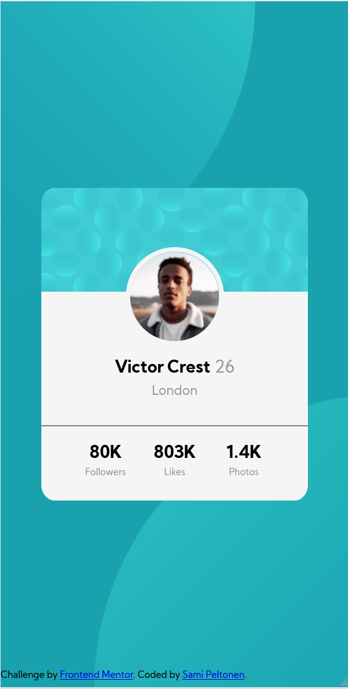

# Frontend Mentor - Profile card component solution

This is a solution to the [Profile card component challenge on Frontend Mentor](https://www.frontendmentor.io/challenges/profile-card-component-cfArpWshJ). Frontend Mentor challenges help you improve your coding skills by building realistic projects. 

## Table of contents

- [Overview](#overview)
  - [The challenge](#the-challenge)
  - [Screenshot](#screenshot)
  - [Links](#links)
- [My process](#my-process)
  - [Built with](#built-with)
  - [What I learned](#what-i-learned)
  - [Continued development](#continued-development)
- [Author](#author)


## Overview

### The challenge

- Build out the project to the designs provided

### Screenshot



### Links

- Solution URL: [(https://github.com/sami-peltonen/frontend-mentor-challenges)]

## My process

My intention was to build this page using as few tools as possible. I didn't want to use media queries, so I had to find a way to scale the elements according to screen size. See explanation below in "What I learned".

### Built with

- Semantic HTML5 markup
- CSS custom properties
- Flexbox
- Mobile-first workflow

### What I learned

I learned how to use CSS more effectively and economically. I'm proud of the following CSS code:

```css
.top,
.bottom {
  position: fixed;
  width: min(170vw, 800px);
}

.top {
  top: -20em;
  left: -25em;
  transform: translateX(10vw);
}
```

After positioning the circular background elements, I used "transform: translate" to move them according to the screen size. This way, the elements scale smoothly, without any media queries.

### Continued development

I need to continue exploring element positioning, as I feel I haven't yet fully grasped the interplay of differently positioned elements.

## Author

- Website - [Sami Peltonen](https://github.com/sami-peltonen)


